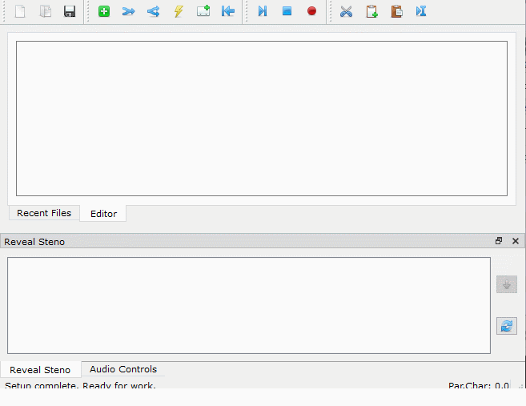

# Set up and display captions

Plover2CAT can display input text in a separate window as captions.

## Caption set up

Click `Audiovisual > Captioning` to activate the captioning settings dialog, use or set the settings below, and then click `OK`.

### `Stay this many words behind`

The most important setting is `Stay this many words behind`. This sets the minimum words behind Plover2CAT will send to be formatted into captions, a "buffer" for making changes.

For example, if the value is 2, and the text is `This is a first example`, after writing `example`, the text `This is a ` would have been sent to captions already. It is possible to undo or change the text `first example` but not the preceding text.

### `Maximum caption length`

The max length for a caption line.

### `Time delay between lines`

The minimum time interval until a new caption is displayed. Lower values mean that captions scroll quickly if input is fast. 

### `Display max lines in window`

If set to zero, all caption lines are kept in window, and the window will scroll if necessary. 

If set to another value, only those many lines will appear in the window, and old lines are removed as new lines are added.

### `Display font`

Click button to change font family and size for window. 

## Turning captioning off

Once the caption window appears, it can be resized as desired, and as writing is done into the editor, formatted captions will appear.

At the end, click `Audiovisual > Captioning` again to turn captioning off. 

## Flushing

At certain times, such as when captions are ending, or there is a long pause, some text will be left in the "buffer" and won't appear in the captions. Use `Audiovisual > Flush Captions` to send the remaining text to be formatted and displayed.

## Remote captions

Plover2CAT can send captions to Microsoft Teams and Zoom APIs and to OBS if WebSocket is enabled. 

### Teams/Zoom Setup

For Teams/Zoom, follow the respctive service's instructions to obtain the remote URL/API token to paste into the Captioning Settings dialog.

### OBS Setup

Captioning to OBS is provided by the `obsws-python` project.

There has to be an existing OBS instance with WebSocket enabled. Three pieces of information are needed for the setup, the host URL, the port, and the password. If this is a local instance, the remote URL/API can be set as `localhost`.

If Plover2CAT receives a failed response code, the code will appear in the status bar at the bottom.

