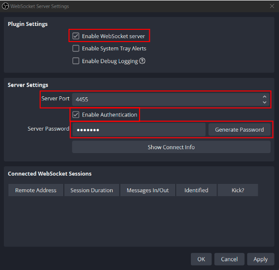
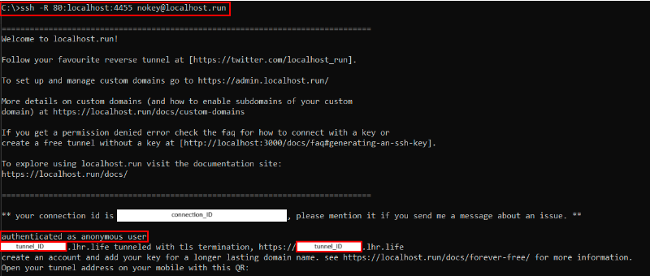
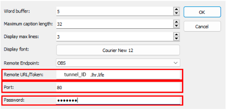
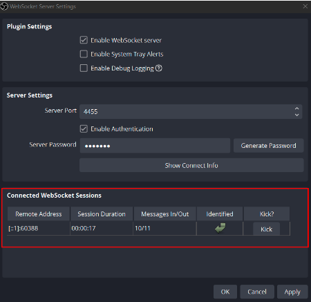

# Set up and display captions

Plover2CAT can display input text in a separate window as captions.

## Caption set up

Click `Audiovisual > Captioning` to activate the captioning settings dialog, use or set the settings below, and then click `OK`.

### `Stay this many words behind`

The most important setting is `Stay this many words behind`. This sets the minimum words behind Plover2CAT will send to be formatted into captions, a "buffer" for making changes.

For example, if the value is 2, and the text is `This is a first example`, after writing `example`, the text `This is a ` would have been sent to captions already. It is possible to undo or change the text `first example` but not the preceding text.

### `Maximum caption length`

The max length for a caption line.

### `Display max lines in window`

If set to zero, all caption lines are kept in window, and the window will scroll if necessary. 

If set to another value, only those many lines will appear in the window, and old lines are removed as new lines are added.

### `Display font`

Click button to change font family and size for window. 

## Turning captioning off

Once the caption window appears, it can be resized as desired, and as writing is done into the editor, formatted captions will appear.

At the end, click `Audiovisual > Captioning` again to turn captioning off. 

## Flushing

At certain times, such as when captions are ending, or there is a long pause, some text will be left in the "buffer" and won't appear in the captions. Use `Audiovisual > Flush Captions` to send the remaining text to be formatted and displayed.

## Remote captions

Plover2CAT can send captions to Microsoft Teams and Zoom APIs and to OBS if WebSocket is enabled. 

### Teams/Zoom Setup

For Teams/Zoom, follow the respctive service's instructions to obtain the remote URL/API token to paste into the Captioning Settings dialog.

### OBS Setup

Captioning to OBS is provided by the `obsws-python` project. 

For remote captions between one computer with Plover2CAT and another streaming to Twitch with OBS, the tested (and free) solution is `https://localhost.run` (thanks Ashen and myth0genesis!) to create an SSH tunnel. Alternative service providers should also work, but reach out on the Plover discord if there are any issues.

"Local" captions will be when Plover2CAT and OBS are both running on the same computer.

To connect Plover2CAT to OBS, follow the following steps for local and remote captions:

(Instructions helpfully provided by myth0genesis and edited by plants)

Basic setup:

1. On the machine that will be streaming video to Twitch, open OBS.
2. Go to the Tools menu, then click on WebSocket Server Settings.

3. Check the box that says "Enable WebSocket server". The default Server Port, 4455, should work fine. If you would like to use a password to connect to your server, check the box that says "Enable Authentication" and generate/set a password.
4. Click Apply.
5. (Remote only) On the same machine, open Command Prompt (it can be found by searching for it in the Start Menu) for Windows or Terminal for MacOS systems. 

6. (Remote only) Enter `ssh -R 80:localhost:4455 nokey@localhost.run` and hit the Enter key. If it works, you should get a series of messages followed by a QR code. This uses the default `4455` port. Change if OBS websocket server is set to a different port.
7. (Remote only) Look for the text `authenticated as anonymous user`. Right after it should be your tunnel address, taking the form of a bunch of letters and numbers (indicated in image as "tunnel_ID") followed by `.lhr.life`. For free users, this link will change each session.
8. On the machine that will be doing the captioning (same machine if local captions), open Plover and the Plover2CAT plugin.
9. Create a new transcript or open an existing one. Open **Audiovisual > Captioning**.
10. In the Remote Endpoint dropdown menu in the Captioning Settings menu, click OBS.

11. (Remote only) Enter the tunnel address that showed up on the streamer's Command Prompt, in the form of `[tunnel_ID].lhr.life` into the Remote URL/Token field. If there's an http:// prefix, don't include that. Enter 80 into the Port field.
12. (Local only) Change the server port (default is 4455) if the OBS server port is different.
12. If you chose a password, enter the password from the Server Password field in the streamer's OBS Server Settings menu, as shown above, into the Password field in your Captioning Settings menu.
13. Click OK.

If everything worked properly, no errors should come up in your system tray, and when you type something into the Plover2CAT editor, the Connected WebSocket Sessions table at the bottom of the WebSocket Server Settings menu in the streamer's OBS instance should show some activity.

Now the streamer should be able to start their Twitch stream like they normally would. As soon as your first captions get transmitted to the streamer's OBS instance, the CC button should show up in the Twitch player, whereupon the captions you send will be visible to whoever enables closed captioning on their player.

If Plover2CAT receives a failed response code, the code will appear in the status bar at the bottom.

