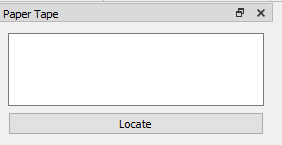

# How to organize, show, and hide docks

Plover2CAT has multiple dock windows, namely `Paper Tape`, `Suggestions`, `History`, `Reveal Steno`, `Audio Controls` and `Toolbox`. They all have a sub-window title, a maximize icon, and a close icon.

To pop the dock free of the main window, there are 2 ways: 1) click on the sub-window title and drag or 2) click the maximize icon. To put the dock back into the main window, click the dock title and drag it over the main window. The dock can be placed on the left, right, top, and bottom parts of the window.

See [this image](https://doc.qt.io/qt-6/images/mainwindow-docks-example.png) for the locations.

To stack docks together, drag one dock on top of another. 

To hide a dock, click the close icon beside the maximize icon and the dock will close. 

Once a dock is closed, there are two ways to open it again. The first way, go to `View` and then `Docks`. It is possible to show and hide any of the docks by clicking the items in `Docks`. The second option is to right-click on the toolbar area (area with the icons under the menu bar at the top of the window). Then click on the different dock names to show/hide them.

