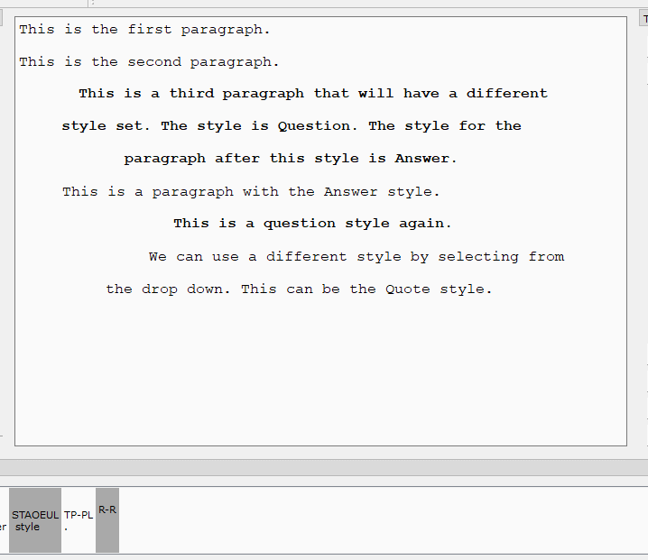

# How to perform a retroactive define

A "retroactive define" in the context of CAT software is when the user has written something, and then wishes to change the translation for the stroke throughout the document, hence "retroactive". 

**Retroactive Define** is located under the **Steno Actions** menu and also on the toolbar.

1. Click and drag to select the text that should be defined. If no text is selected, nothing will be done. 

2. Click **Retroactive Define**.

3. Review the Retroactive define dialog showing the steno underlying the selected text. 

4. Enter the new translation into the user-editable text box. 

5. Click `OK` to confirm.

This new outline is added to the transcript dictionary. The editor will search and replace all occurrences of the *selected text* in the document. The underlying steno is not changed.

