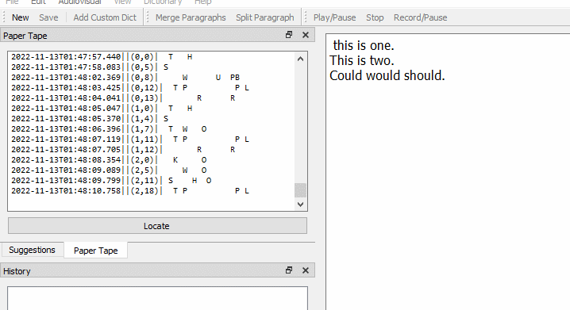

# Navigate to paper tape and back

The paper tape and the editor are linked through the data on the strokes.

To navigate to the part of the paper tape when the strokes producing specific text, place the cursor in the editor text, and the paper tape will automatically scroll to the correct location.

To find text produced by a stroke, select the stroke in the tape. Then press the `Locate` button. If text produced due to the selected stroke was erased, the editor will not change, otherwise, the cursor will move to the text.

