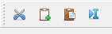

# How to organize, show, and hide toolbars

Toolbars are collections of icons providing shortcuts to various menu items. Each toolbar consists of a handle and icons.

It is possible to move the toolbar around by clicking on the handle and dragging. The toolbar can float on its own outside the window or be placed at the top/bottom/left/right sides of the main window.

To toggle showing/hiding of toolbars, right-click on the toolbar area (not the icons). Then click to toggle visibility of the desired icons.