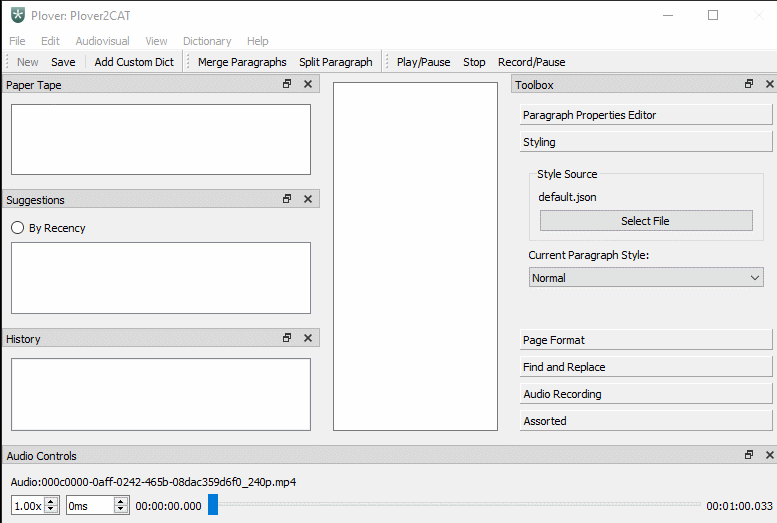

# How to show and hide video

When Plover2CAT detects that there is video available in the media file, it will create a separate window to display the video. This window can be moved and positioned separately from the main window. This window is set to stay on top of other windows if possible.

To hide this window, go to **Audiovisual > Show/Hide Video**. This will toggle to show or hide the video window depending on the present state. 