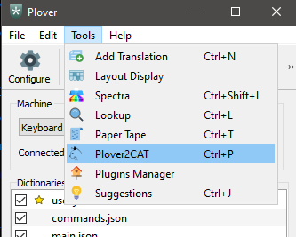
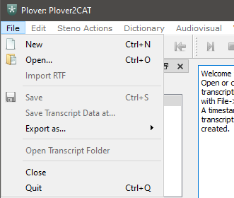

# Create New Transcript

`Plover2CAT` should be installed installed (see [previous tutorial](install-plover2cat.md)) for this tutorial.

In this tutorial, you will learn how to create a new transcript in Plover2CAT.

## Open Plover2CAT

Open Plover and then open **Plover2CAT** from the **Tools** menu.

The editor window will open.

## Create transcript folder

Click on **File > New** in the menu.

An empty transcript will appear in the center editor, with a tab name of  `transcript-TIMESTAMP`. It is now possible to write into this editor. 

## Save transcript

To save the transcript, use **File > Save** or `Ctrl + S`  to save. 

The default name for the transcript uses the format `transcript-TIMESTAMP`. It is possible to change the default name to any that the file system will accept (those without forbidden characters such as `"` in Windows).

A folder with this name will be created containing necessary subfolders and text files.

