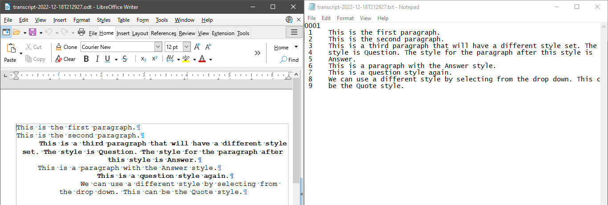

# Exporting Transcript

This tutorial covers exporting a transcript in plain ASCII format and Open Document Format text document. You will need a transcript to export.

## Export Plain ASCII

This export format is a plain text file formatted according to Ipsos Eclipse transcript format. It is single spaced, with 25 lines per page, and page numbers to start each page. 

To export to this format, go to **File > Export as > Plain ASCII**.

A file dialog will appear. You can accept the default name and file extension.

After export, the file will exist in the `export` folder of the transcript folder. To easily access the transcript folder, click **File > Open Transcript Folder**. You can navigate to the `export` folder and open the `.txt` file with any text editor.

## Export Open Document Format

An Open Document Format text document can be exported from Plover2CAT with the `.odt` ending. Select **OpenDocumentText** from the **Export As** submenu.

You can open the `.odt` file with Libreoffice, Microsoft Office, or other word processors. 

In comparison to the Plain ASCII file above, you can see that formatting has been preserved.

Now you can close the transcript through **File > Close** or by pressing the red X button on the tab.
