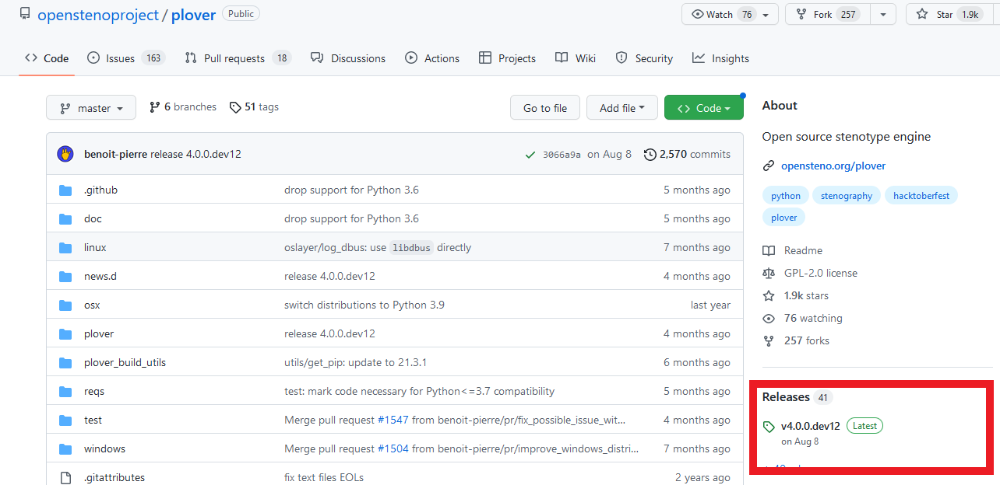
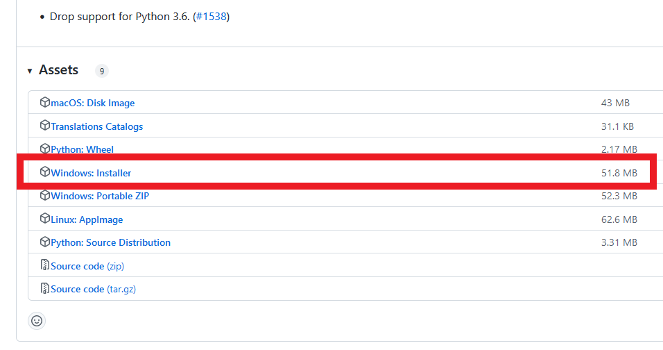
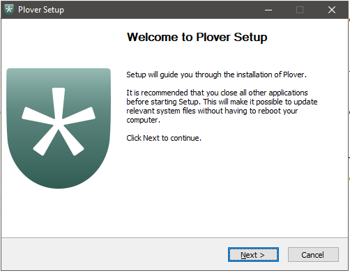
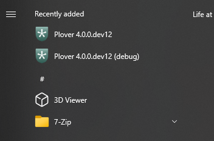
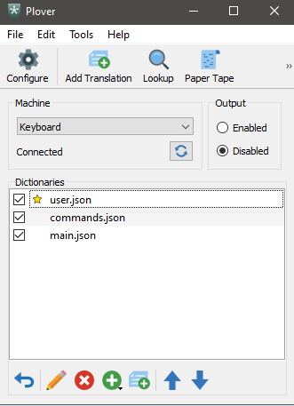
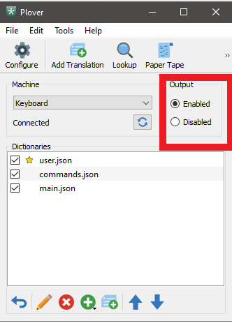
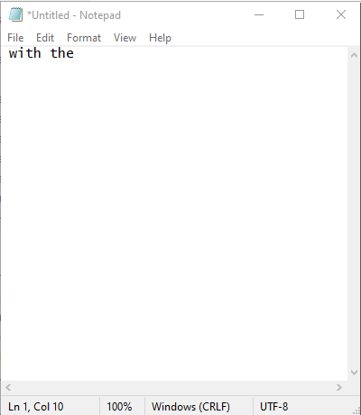

# Install Plover

> If you already have Plover installed, skip this tutorial.

This tutorial covers installing Plover, primarily on the Windows operating system. You will be downloading Plover, the open-source stenography engine, installing it, and checking that it works. Plover will allow you to write stenography using your computer keyboard or other machines. Different combinations of key presses will be translated by Plover into text.

## Download Plover from github

Go to the [Plover github page](https://github.com/openstenoproject/plover).

You will downloading the most recent version. 

Go to the right of the page, and click on the link with the green `latest` tag before it under the `Releases` heading.

The release page contains information about the new release, such as features and fixes. Scroll down to the bottom of the page, where there is a heading of `Assets` with a list of files under it.

You will want to download the proper installer for your operating system. For Windows, this would be the `Windows Installer`. See the `Installation guide` on the release page for instructions on other operating systems. 

Click to download the Windows Installer. The file is one that ends in `.exe`.

Click the `exe` file to start installation. You may need to give permission for the program to make changes.

Follow the steps in the installer wizard (accept the user agreement, determine whether to install for everyone on the computer or just yourself). You can accept the default folder Plover gives to install to. It might be something similar to `C:\Program Files\Open Steno Project\Plover 4.0.0versionNumber`. Then select whether you want shortcuts created.

Plover will complete the installation to the folder.

Close the installer after it is completed.

## Open Plover

Open the Windows Start Menu. Windows may or may not have Plover at the top under `Recently Added`. There will be two programs starting with `Plover`, one as `Plover versionNumber` and the other as `Plover versionNumber (debug)`.

For this tutorial, use the version of Plover without the `(debug)` in the name.

The Plover GUI window will appear once the program starts.

## Writing

Out of the box, Plover uses the 23-key English stenotype layout. How the system works and the stenography theory are out of the scope of this tutorial.

To test that Plover is functioning properly, you will write using the computer keyboard.

Open a program you can write into, such as Notepad, Microsoft Office, or even the address bar of your web browser.

You will first have to enable output from Plover. In the plover window, click `Enabled` from the `Output` box on the right side of the window.

Switch to the window you want to write into. Place your cursor.

Press the `w` key on your keyboard. Then release the key and press `p`. The words `with` and `the` should have appeared in the window.

## Learning Stenography

At this point, if you are new to Plover, you will want to look into learning the theory and how to use the Plover program. See a collection of learning resources on the [plover wiki](https://github.com/openstenoproject/plover/wiki/Learning-Stenography). 

