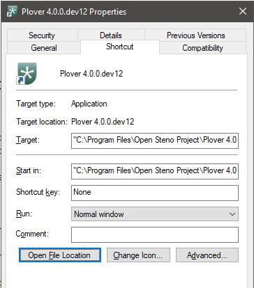
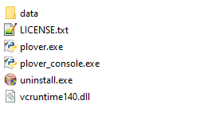
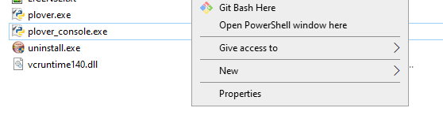
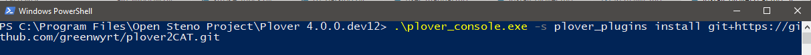
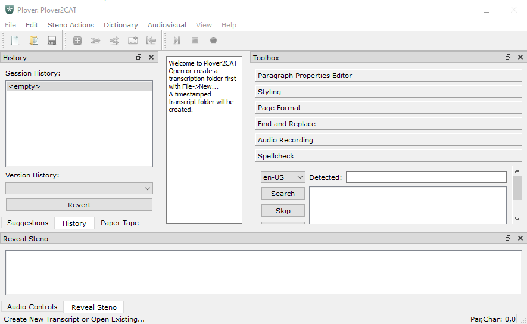

# Install Plover2CAT

> If you already know how to install plugins on the command line, skip this tutorial.

This tutorial covers how to install Plover2CAT, a Plover plugin for computer-aided transcription (CAT) on the Windows operating system. 

You will need to have installed Plover already (see [install tutorial](install-plover.md)).

## Find the Plover directory

To install, you need to first find where the Plover plugin is located on the computer. It may be in `Program Files > Open Steno Project` or another place on the computer.

One way of finding the location is through the start menu (if you selected installing shortcuts). Search for Plover. 


Click the arrow next to Plover, there will be choices for `Open`, `Run as Administrator` and `Open File Location`.

Click `Open File Location` and the file explorer will open with the Plover shortcuts. 

Click on `Properties` with the shortcut selected, and a window will popup. Alternatively, right-click on the shortcut and select `Open File Location`.



Then click the `Open File Location` button for the Plover directory to open.

The folder will contain `plover.exe`, `uninstall.exe` and `plover_console.exe` among other files.



## Open Command Prompt

To open command prompt, hold the `Shift` key and then right-click. On the menu, click `Open Powershell Window`.



At this point, close Plover if it is running. Make sure to exit Plover completely by `Quit`, rather than Plover just being minimized to the tray.

## Use this command

To install Plover2CAT, copy the line below, and paste it into the powershell window.

```
.\plover_console.exe -s plover_plugins install git+https://github.com/greenwyrt/plover2CAT.git
```



Then press `enter`. Plover may take some time to install and there will be text appearing notifying what is being done.

At the end, the last line of the messages should be something like `Successfully installed plover2cat-version`.

## Check Installation

Open up Plover. Plover2CAT should appear if you view the `Tools` menu.


Click `Plover2CAT` and a new window should appear.



