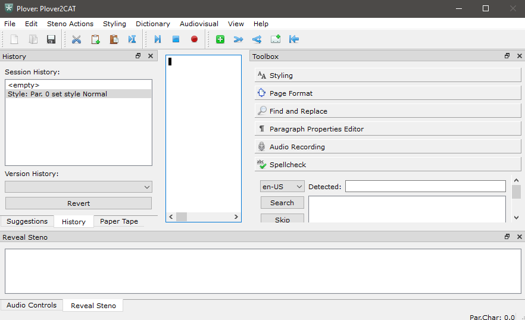
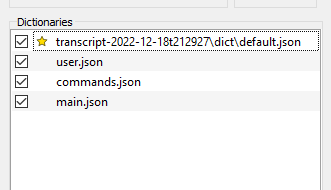
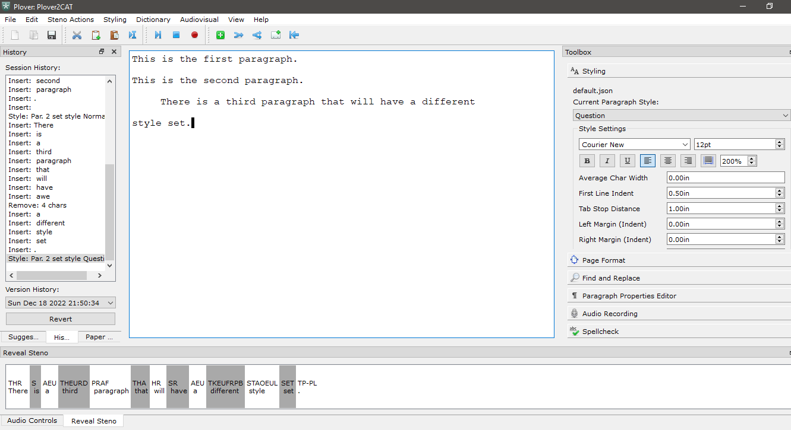
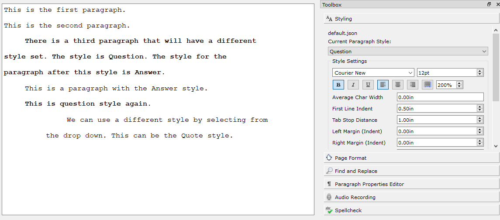
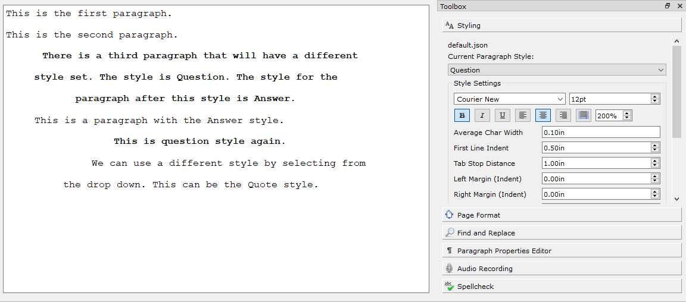

# Writing in the Plover2CAT Editor

> This tutorial assumes you already know how to create a new transcript in Plover2CAT.

This tutorial covers writing in Plover2CAT, changing style properties and saving the file.

## Writing

Create a new transcript. You will know you are in a transcript when **File > New** or **File > Open** menu items are faded out (and so are their corresponding icons on the toolbar), and the tab has the transcript name.

In addition, when Plover2CAT holds an open transcript, the transcript dictionary will be loaded into Plover. You can see it in the Plover dictionary pane.

Enable Plover output and click the editor. A cursor should appear. Write as normal. 

The words will appear in the center editor pane. Click on the Paper Tape tab on the left. A paper tape similar to the one that Plover has is there. However, this tape includes the date and time each stroke was made, as well as the position of the cursor at the moment.

Now look to the right side. Click on the headings within the toolbar to open them. Open the "Style" page. Here, you will see that the present paragraph has the "Normal" style. The "Style Settings" below show the properties for the style. You can see that the font for the normal style is Courier New, at 12pt size, the text is left-aligned and so on. Scrolling down on the page, you can see that the "Normal" style has no parent style set, and that the "Next Style" is set to Normal.

> Note: New lines in Plover should be set as \n and not {#Return}. Use the R-R stroke with \n to start a new paragraph.

 When you create the second paragraph, you will notice that the paragraph style is still Normal.

 ## Set Paragraph Style

 Write something for a third paragraph. Then select "Question" from the Current Paragraph Style drop down. You will see the formatting change on the third paragraph.

 

 In the default styles, the Question style is set to have a text indent for the first line of the paragraph, and that is also shown into the editor. In addition, the next style for Question is Answer.

 ## Automatic setting of style with Next Style

 Starting in your question style paragraph, make a new paragraph. You will see that the "Current Paragraph Style" is now set to Answer.  Look at the next style for Answer. It is Question. So if you make another paragraph, the new paragraph will have the Question style.
 
 ## Changing a style property

Changes to properties of a style are applied document-wide. For example, you can make the Question style bold. Go to a paragraph that uses the question style, click the bold icon, and then click the "Modify Style" button at the bottom of the Styling pane.

 

 See how both paragraphs with the Question style now have bolded text.
 
 You can also change the alignment.

 

 ##  Save and Versioning

To save the transcript, use **File > Save** or `Ctrl + S`  to save. 
Click to the History tab. You will see that under version history at the bottom, it shows the time of your last save.

Now you can close the transcript by **File > Close**.  **DO NOT** use the `Alt+ F4` or `ESC` as that causes an instant exit without saving.

Repope the transcript again by using **File > Open**, and then selecting the `config.CONFIG` file in the file dialog. Your transcript will be loaded back in.

You can revert changes from your previous saves.

First, add some more writing to the document. Save again.

Then select a previous time from the Version History dropdown in the History dock. The text in the editor will now have the text of the version at that time. Notice that this `revert` creates a save as well.

