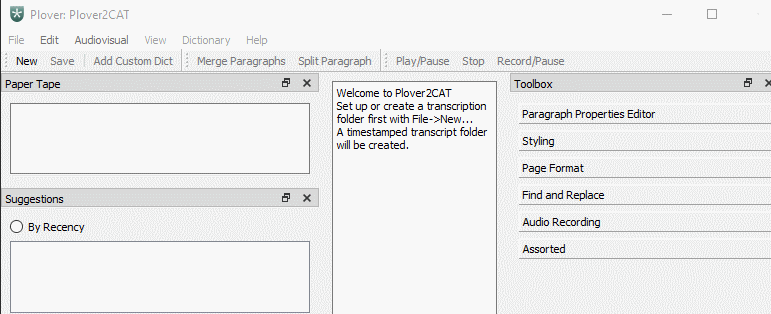
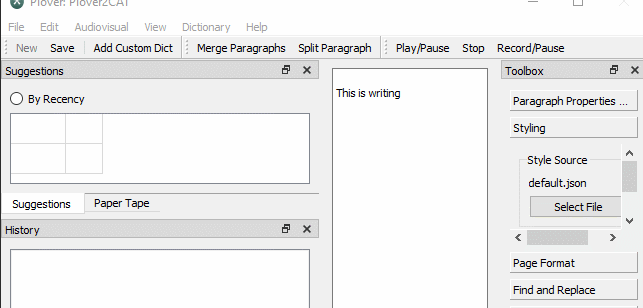
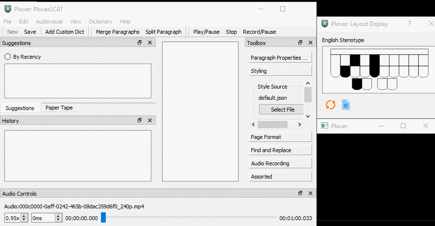
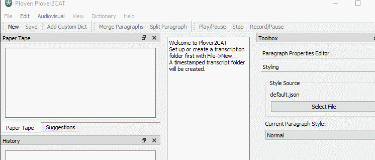
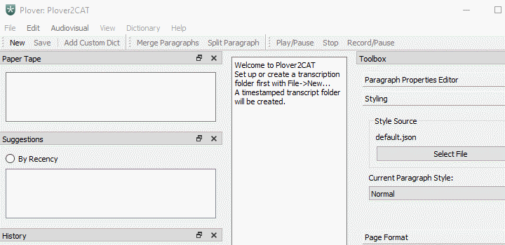

# Introduction

Plover2CAT is a plugin for Plover, the open-source stenography engine. If the only user requirement is to write steno on the computer, this plugin is not needed as Plover is more than sufficient. Plover2CAT provides some of the features from computer-aided-transcription (CAT) programs to help produce a transcript for captioning or other purposes. 

# Features Overview:

- [x] a plain text editor with steno hidden underneath
- [x] timestamps for each stroke and associated with each piece of text
- [x] conventional editing features such as cut/copy/paste while keeping steno data attached
- [x] undo/redo history
- [x] automatic creation and loading of transcript-specific dictionaries for each transcript
- [x] find and replace for simple text, steno stroke, and untrans.
- [x] retroactive define, and define last translate with replacement of all previous occurrences and new outline sent to transcript dictionary
- [x] an audiovisual player, with controls for timing offset, playback rate, skipping forward and back
- [x] synchronization of steno with the audio/video file for transcription
- [x] audio recording synchronized with steno (file format dependent on codecs in operating system)
- [x] export transcript to plain text, Eclipse ASCII, SubRip, and Open Text Document formats (with style templates)
- [x] saves paper tape with keys pressed, position of cursor in document, and timestamps at each stroke
- [x] suggestions based on stroke history (powered by Tapey Tape), updated every paragraph
- [ ] basic import of RTF/CRE transcript

This plugin is built on Plover and inspired by [plover_cat](https://github.com/LukeSilva/plover_cat). 


# Getting Started

Download the code from this repository. Open the terminal following instructions here [on the command-line](https://github.com/openstenoproject/plover/wiki/Invoke-Plover-from-the-command-line). On Windows, use:

```
 .\plover_console.exe -s plover_plugins install plover2CAT
 ## use install -e for development
```

On MacOS and Unix systems, use `plover` rather than `plover_console.exe`.

## Starting a New Transcript

Open Plover2CAT from within Plover after installation, by Tools --> Plover2CAT. A window with a main editor, and dockable containers for suggestions, paper tape, and other functions will appear. Create a new transcript with File --> New (or `Ctrl + N`). A folder selection dialog will appear. Plover2CAT will create a transcript folder with a timestamp at the selected location.

Once Plover is enabled, writing to the main editor will be possible. The main function of Plover2CAT is for writing steno, and by default, only steno translated by Plover will be written (and deleted with the `*`). 

A custom dictionary for the transcript is loaded into Plover, prepopulated with shortcuts for common actions. When File --> Close is used to close the transcript, the custom dictionary will be removed from Plover.

## Opening an Existing Transcript

Select the `config.CONFIG` in the transcript folder to open the transcript.

## Default CAT behaviour

Check "Lock Cursor at End" and "Capture All Steno Input" to only write to end of document and to still write even when editor window is not in focus. By default, writing is inserted into any part of text, and only when window is in focus.

## Opening Audiovisual Files

Select an audio file on the computer by Audio --> Open Audio (`Ctrl + Shift + O`). When audio is playing, steno strokes will be timestamped with the audio time. Open the "Paragraph Properties Editor" in the Toolbox pane to see the timestamps associated with each paragraph.

## Recording Audio

Open "Audio Recording" in the Toolbox Pane to select parameters for recording such as the input device. Click Record/Pause on the toolbar or through Audiovisual --> Record/Pause to start recording. Use Audiovisual --> Stop Recording to stop recording. 

## Saving and Export

The transcript will be saved as an JSON file within the created transcript folder when File --> Save (`Ctrl + S`) is used.

The available export formats are:
  - Open Document Text
  - SubRip
  - ASCII
  - Plain Text

For more details on each format and the different requirements, see the User Manual. 

## Close Transcript

Use File --> Close to close the transcript and File --> Quit (`Ctrl+Q`) to quit the editor, with optional check to save if changes have been made. **DO NOT** use the `Alt+ F4` as that causes an instant exit without saving.

# Layout

Hover over items to see tooltips.



## Status Bar

The status bar at the bottom of the window shows important events and warning messages.

## Main Editor

The main editor is located at the center of the window. This is where the writing shows up. By default, it is not possible to edit the contents of this area using a normal keyboard. The cursor, for now, is always kept at the end of the text when writing.

## Menu

The menu is the top bar of the window. A brief summary is outlined for each menu item. More complicated menu items and their use will be described in the [editing](#editing) section.

### The File Menu

This menu contains items related to file management, import and export.

- New: This creates a timestamped folder named `transcript-YYYY-MM-DDTHHMMSS` and sets up the editor for writing.
- Save: This saves the transcript as a JSON file in the folder.
- Open: This is used to load a previously created `transcript-YYYY-MM-DDTHHMMSS` by Plover2CAT by selecting the `*.config` file in the project folder.
- Import RTF: import a RTF/CRE transcript file from other CAT software. See [Supported RTF Import](#supported-rtf-import) for details.
- Export As: This submenu lists the different export formats. For specifics on each format, see the [formats](#formats) section.
- Close: This closes the transcript.
- Quit: This quits Plover2CAT.

### The Edit Menu



For more detail, go to the [editing](#editing) section. There is a 10-action history for undo/redo.

- Merge Paragraphs: Merges two paragraphs together.
- Split Paragraphs: Splits one paragraph into two.
- Cut: cut text (and underlying steno) from paragraph.
- Copy: copy text (and underlying steno) from paragraph.
- Paste: paste text (and underlying steno) into paragraph.
- Normal Copy: copies text only.
- Undo: Undo one action ie merge, cut if available.
- Redo: Redo the undone action if available.
- Find/Replace Pane: shows the "Find and Replace" pane if visible. See [Find and Replace](#find-and-replace) section for details.
- Reset Paragraph: Removes all paragraph text and steno data. Used as the last option when text and steno data go out of sync.

### The Steno Actions Menu

This menu is for steno-related menu items.

- Lock Cursor at End: If checked, the cursor will be placed at end during writing, and all text is "appended" to end of document. 
- Capture All Steno Input: If checked, all writing through Plover will be tracked, and text emitted into editor, regardless of whether editor window is in focus. By default, no writing to editor when window is not in focus.
- Retroactive Define: Define an outline after writing it.
- Define Last: Define last preceding untranslate before cursor.
- Autocompletion: start up autocompletion. Requires a `wordlist.json` in a `sources/` dictionary.

### The Dictionary Menu

This menu is for transcript dictionary management.

- Add Custom Dict: Add a custom dictionary to the transcript. See  [transcript dictionaries](#transcript-dictionaries) for details.
- Remove Transcript Dictionary: Removes a loaded transcript dictionary. This will remove both from the Plover instance and the configuration file, but not delete the actual file.


### The Audiovisual Menu




This menu contains items related to audiovisual files.

- Open Audiovisual: This opens a file dialog to select an audio file.
- Play/Pause: This plays and pauses the audio depending on the present state.
- Stop: This stops the audio, returning to the beginning.
- Skip Forward: This skips the audio forward by 5 seconds.
- Skip Back: This skips the audio back by 5 seconds.
- Speed Up: This increases the playback rate by 0.02.
- Slow Down: This decreases the playback rate by 0.02.
- Show/Hide Video: If a video file is selected to be played, then a video window will pop-up. This will show/hide the video window.
- Record/Pause: This starts recording using the settings in the audio recording box. If already recording, pressing this will pause recording, which is not the same as to press Stop Recording.
- Stop Recording: This stops any recording in progress.  If Record/Pause is pressed again, the present audio file is overwritten.

### The View Menu

This menu contains items related to view.

- Zoom In: This increases the zoom on the main editor. The size from this and `Zoom Out` are "temporary", meaning they will fall back to normal if a document is loaded, such as opening/closing projects.
- Zoom Out: This decreases the zoom on the main editor.
- Font: This controls the actual font and size. This is saved when exiting and will be maintained across sessions.
- Docks: Toggle the visibility of each dock.

### The Help Menu

This menu contains help:

- Online User Manual: click to go to the online user manual (this document).
- Acknowledgements

One of the goals in future development is to replace the online user manual with an offline manual packaged with the plugin using the QHelpEngine in Qt. 

## Toolbar



The toolbar (located under the menu) contains shortcuts to commonly used items in the menu, and each item is described in the [menu](#menu) section. The different segments of the toolbar can be re-arranged or pulled out to float independently.

## Panes

Plover2CAT has multiple panes which are arranged around the main editor on startup. These panes are "dockable", and can be moved independently by clicking and dragging on the window bar. As with all Qt dockable widgets, these panes can be 1) floating, 2) placed on the top, left, right, or bottom of the window, and 3) stacked on top of each other. Each pane can be closed if not needed. To re-open the panes, right-click the toolbar and select the desired pane. 



### Paper Tape

This pane shows an alternative version of the Plover Paper Tape.
Each time a stroke is pressed, the stroke is saved to a `.tape` file in the `transcript-YYYY-MM-DDTHHMMSS` folder. 
See [Tape](#tape) for a description of the format.

The paper tape is linked to the text and will scroll to the corresponding stroke when the cursor in the editor moves.


Highlight a stroke in the paper tape, and click "Locate" to move to that position in the main text editor. 

### Suggestions

Plover2CAT uses the [Plover Tapey Tape plugin](https://github.com/rabbitgrowth/plover-tapey-tape) for suggestions, in the default format and in the default location (`tapey-tape.txt`). If the plugin is not installed, or the location and format of the file is not the default, suggestions within Plover2CAT will likely not work. 

Suggestions can be sorted by most common (default), or most recent (toggle the `By Recency` option). 

Entries will show up to the ten most common/recent entries, only if Tapey Tape has suggested an alternative outline thrice before. 

The truly nitty-gritty: for users who have a custom output format defined for Tapey Tape, if `%s` is part of the format, the suggestions should be extracted properly as the regex relies on the presence of the two spaces and `>` before a suggestion.

### Reveal Steno

This is a table which shows the current paragraph's text, and the steno underlying the text. It will update when the cursor moves, and the paragraph is non-empty.

### History

Plover2CAT keeps track of all editing in the editor. The History Pane lists the actions performed, with new actions appended to the end. Clicking on an action before the end will undo all actions to that action, and clicking below will redo actions. 

### Audiovisual Controls

By default, the audio controls pane is located at the bottom of the window. 

`Play/Pause` and `Stop` buttons are not part of this pane, they exist in the toolbar and menu. 

The first input box, with default number `1.00x`, is the playback rate. The `Speed Up` and `Slow Down` menu items will increment up/down this number by 0.05.

The second input box, with default `0ms`, is the audio delay, measured in milliseconds. This number represents the difference between the actual position of the audio and the audio time recorded with the steno. For example, if `KAT` was stroked at 1 minute and 23 seconds, and the audio delay is 2 seconds, `KAT` is recorded at being stroked at 1 minute and 21 seconds. There are no shortcuts or menu items to control this. Adjust using the arrow buttons of the input.

The horizontal slider is the track, with time position on the left, and total duration of the track on the right. Move the slider to skip to the desired position.

Codecs may have to be installed on the operating system to play certain audio/video formats.

### Toolbox

The Toolbox pane contains pages of different controls. See the [tools](#tools) section for details.

# Editing

Many of the editing functions work exactly like they do in normal word processors, with certain caveats. The work in keeping the steno organized occur in the background.

## Normal Writing

Write into the editor pane in the middle. The cursor is placed at the end after creating/opening a transcript. Click at other places in the text to move the cursor and insert text.

## Add Custom Dictionary

Select a dictionary from the filesystem and load into Plover2CAT. Use this instead of the Plover Add Dictionary as this will copy the dictionary into the `dict/` folder so it will be loaded and removed from Plover automatically when the transcript is opened or closed while remaining self-contained.

The `default.json` is a good place to add transcript-specific outlines if there is only a few.

## Remove Transcript Dictionary

Plover2CAT keeps track of the transcript dictionary and all other added custom dictionaries. The editor will load them into Plover when the transcript is opened. To remove a dictionary, use this rather than Plover's "Remove Selected Dictionary". A file dialog will open in the transcript's dictionaries directory for selection of a dictionary to remove. This will prevent Plover2CAT from loading the removed dictionary the next time. 

## Split Paragraphs

Click to set the cursor or click and drag to select characters. The "split" will occur at the beginning of the selection or the visible cursor. A newline character sent through Plover will cause the same effect. If the selection includes an entry at the start, and the option `Before Output` for space placement in Plover, then the initial space will be removed in the new paragraph. `space_placement` is set as part of the `config.config` file when the project is first created. This option should not be changed after any steno has been input as it will mess up the underlying steno rearrangements.

## Merge Paragraphs

Select text or place cursor in the *second* of the paragraphs for the merge. This paragraph will be appended to the previous paragraph. By default, an empty space is added between the two paragraphs. Alternatively with the keyboard, set the cursor to the beginning of the second paragraph and stroke to have Plover send a backspace (but a space will not be added inbetween).

## Copy

Selected text and underlying steno will be copied.

## Cut

Selected text and underlying steno will be copied and removed from original paragraph to be pasted.

## Paste

Insert selected text and underlying steno from previous cut/copy actions.

## Normal Copy

This is a convenience for copying to other applications as only *regular text* is copied to clipboard. The above copy/cut do not send anything to the computer clipboard, and only work within the editor itself.

## Undo/Redo

Plover2CAT keeps track of all the actions performed in the editor such as writing, "deleting" and cut/paste. This is visualized in the `History` Pane.

The normal shortcuts `Ctrl + Z` and `Ctrl + Y` can be used to undo/redo. 

## Autocompletion

An autocompletion feature has to be toggled through the Steno Actions menu. The choices for completion have to be provided by a `wordlist.json` in a `sources/` folder within the transcript folder. The format for the file is described in [Wordlist Format](#autocomplete-wordlist). 

Choices can be scrolled using arrow keys on the pop-up. It is **essential** that an outline is mapped to `{#return}` in one of Plover's loaded dictionaries. That outline/stroke has to be used to select the autocomplete choice. Using an outline mapping to `\n` will cause a new paragraph to be started in addition to making the selection.

# Tools

## Paragraph Properties Editor

The editor will automatically fill in paragraph properties such as when a paragraph is created, or the associated audio time. However, sometimes finer control is needed. 

By default, the properties are locked. Uncheck the `Lock` checkbox in order to edit `Creation Time`, `Audio Start Time` and `Audio End Time` and `Notes`. For what these properties mean and how they are created, see the [Editor](#the-editor) section. `Paragraph` and `Edit Time` are uneditable fields. Submit edits by pressing the `Edit Paragraph Properties` button. 

Any new steno input will cause the lock to be re-enabled (and editing disabled).

## Styling

Select the paragraph formatting styles when exporting to OpenDocumentText format. The default styles appear under "Current Paragraph Style" to set the style for the current paragraph.

Default styles are provided in the `default.json` file within the `styles` directory. This file contains text and paragraph properties for the common styles using OpenTextDocument element names, such as "Normal", "Question", and "Answer." 

It is possible to indicate a `nextstylename` element. Once this style is used, Plover2CAT will automatically switch to the next style when a new paragraph is created, so it is possible to alternate `Question` and `Answer` paragraphs.

Any ODF elements allowed in the text and paragraph properties can be specified within the `style.json` styles (the odfpy library uses the element name without the hyphens ie `margin-left` to `marginleft`). Unknown elements will be ignored.

If a `ODT` file is supplied as a template, the drop-down box will be repopulated with the document's styles. Paragraphs with pre-existing styles will not be changed so it is best to supply the ODT before writing, or match the names of the styles in the `ODT` document to the default style names. The page format of `ODT` will override the page format parameters as well. 

Much more customization can be done using an `ODT` file as a template. Plover2CAT will append the transcript contents to the document, so if an `ODT` with a title page is supplied, the transcript contents will appear after the title page. 

Any style file (`JSON` or `ODF`) will be copied to the `styles` directory in order to keep the project self-contained.

## Page Format

This is used for exporting to OpenDocumentText format. The different fields should be self explanatory, controlling the different page margins and page dimensions. Line numbering can be checked or unchecked depending on need. This page format will apply to the entire document. The values are stored in the `config.config` file, along with other project attributes.

If an `ODT` file is used to set styling, page format parameters are overridden. 

## Find and Replace

There are three kinds of find: text, steno, and untranslated, each with different options available. Searches can be forward or backward, and wrap around if selected.

Use `Ctrl+F` to move to the find and replace pane.

### Text Find

This will searching within translated text on the editor screen. Options for case sensitivity and whole word are available.

If any text in the editor is selected, it will automatically be put into the "Find" input box if `Ctrl+F` is used.

### Steno Find

This will search the within the underlying steno. The search text must match the stroke completely ("Whole Word/Stroke" option checked by default) such that `ST` will match `ST` but not `ST-T`. The search text must be valid steno ad there is no case-sensitivity.

### Untrans Find

This will search for any text that appears to be an untranslated steno stroke within the translated text. Only whole "words" in steno order and 3 or more letters long qualify as an untrans.

### Replace

If any of the three find methods has a match, it will be highlighted in the editor. The text in the "Replace" input box will replace the translated text. The underlying stroke data will not be changed.

### Replace All

This will search and replace all matches with the replacement text. This counts as one action, so undo will undo all replacements.

## Audio Recording

The audio will be saved automatically to the `audio` directory. A second attempt at recording will overwrite the existing file.

The options in the dropdown boxes will vary depending on the individual operating system.

- Input Device:  Choices will be any audio inputs available to the computer such as a microphone.
- Audio Codec: Windows systems like have PCM WAV at a minimum.
- File Container: A guess on the file format for the audio will be made based on the audio codec. If the codec is not one of the common ones, the audio file will not have a file extension, and users have to manually adding a file extension after recording is done.
- Sample Rate and Channels can be left on default, and the software will pick the best fit.
- Encoding Mode
  - Constant Quality: The recording will be done based on the quality slider, varying the bitrate to keep the same quality.
  - Constant Bitrate: The recording will use the same bitrate throughout, but quality of the recording will vary.


# Formats

This section goes into detail on how these formats are implemented in the plugin. Most of the information is only relevant for development of the editor and making custom export formats based on the data.

## The Editor

The editor is a QPlainTextEdit component. To most users, the only relevant aspect is that the text is organized into paragraphs, and data is stored on a per-paragraph basis.

There are several base properties:

- Creation Time: this is the time that the paragraph is created. If it does not exist, the default is the time for the first stroke (see `steno data` below).
- Edit Time: this is the time of the last change to the paragraph. In the Paragraph Properties Editor, this property is not editable. the time will be modified each time there is a change to the paragraph and as a result, any manual edits will be overwritten.
- Audio Start Time: this is the time from the audio playing when the paragraph is created. This property can be edited, and should be used when trying to match timing, such as for captions.
- Audio End Time: this is the time when the audio has "passed on" from this paragraph. By default, if a paragraph does not have this property set, the audio end time for the paragraph is the audio start time of the subsequent paragraph. When `Stop Audio` is pressed, the time of the audio at the stop will be set as audio end time of the paragraph. Having one audio end time at the end of the transcript is important for making valid SRT caption files.
- Style: this is mostly useful for associating an ODF paragraph style with the given block for exporting to an Open Document Text file. See [styles](#styles) for the format and how to use.
- Notes: this is a text property for the user to make notes.

## Steno data

This section below describes in some detail how QPlainTextEdit and the data structures is used, which may not be so apparent in the code.

### `stroke` data

The most important hidden property of each paragraph is the steno.

For each paragraph, there is a user data object (subclassing `defaultdict`) containing the base properties from above, and also holding the steno strokes (`strokes`) with corresponding text strings. The `strokes` entry is a list of lists, each element list having either three (or four) elements:
- time of stroke
- steno keys pressed
- text string
- audio time (optional)

An example of a list in `strokes` is:

```
["2001-01-01T01:23:45.678", "-T", "The"]
```

Two strokes in the paragraph will appear like this:

```
strokes = [
["2001-01-01T01:23:45.678", "-T", "The"],
["2001-01-01T01:23:46.789", "KAT", " cat"]
]
```

Notice the space before `cat`. This is a result of Plover with the `space before word` setting.

If the user strokes `-S`, Plover will output ` is` as the text. Then `strokes` will be updated to:

```
strokes = [
["2001-01-01T01:23:45.678", "-T", "The"],
["2001-01-01T01:23:46.789", "KAT", " cat"],
["2001-01-01T01:23:46.789", "S-", " is"]
]
```

If `*` is used, Plover will emit *three* backspaces (two spaces for `is` and one for the space at the front). Then `strokes` is updated back to: 

```
strokes = [
["2001-01-01T01:23:45.678", "-T", "The"],
["2001-01-01T01:23:46.789", "KAT", " cat"]
]
```

### Modifying on the `stroked` hook in Plover

Of the three engine hooks with data for `strokes`, `stroked`, `send_string` and `send_backspace`, the two `send_*` hooks will trigger before `stroked`. Therefore, `stroked` is used as the trigger to update the `strokes` data, as by then the number of backspaces and text string Plover emits for the stroke are available. If done the other way around, `send_string` will not know the present stroke, and the code becomes more complicated with the `strokes` data always a step behind. 

The `on_stroked` function in the code is the workhorse of the entire editor. It sets properties of the paragraph and modifies them before inserting the text Plover outputs, and also deleting text based on the number of backspaces Plover outputs.

### Lossy `stroke` data

Each time a stroke is written, Plover2CAT will first parse the the number of backspaces and/or text string the Plover engine outputs. The text string element (third) in the `strokes` sub-lists will be modified. The resulting `strokes` list will contain a *lossy* representation of the steno and the text as the backspaces Plover emits are used, but not recorded explicitly. 

Note the first example above where `is` is undone by `*` from the string `The cat is`. If another word is written (ie `The cat had` as `-T KAT H-`), there is no record of the stroke `S-` and `*` in the `strokes` data (though it will exist in the tape `-T KAT S- * H-`, making the tape the definitive and most accurate record on what was written). `S-` and `*` are not necessary to form the text string and are "dropped" in a sense.

Take for example writing `pleasing`.

```
strokes = [
["2001-01-01T01:23:45.678", "PHRES", "please"]
]
```

When `-G` is stroke, for the suffix `-ing`, Plover will emit one backspace (to remove the `e`), and the text string `ing`. The stroke representation will become:

```
strokes = [
["2001-01-01T01:23:45.678", "PHRES", "pleas"],
["2001-01-01T01:24:56.789", "-G", "ing"]
]
```
One benefit of doing this is that the user can still search the steno for the stroke `PHRES` and find `pleasing`. 

## Actions

Writing/removal of steno has been implemented using custom `QUndoCommand` classes. They are `steno_insert`, `steno_remove`, `split_steno_par` and `merge_steno_par`. The former two commands simply insert/remove text and associated steno from the `stroke` data.

### Merging and splitting paragraphs

With the QPlainTextEdit, when a paragraph is deleted, so is the data associated with it. But when the QT undo is used to restore the deleted paragraph, the data is still gone. This creates problems when a user merges paragraphs (by backspacing) or creates a new paragraph in the middle (pressing `enter`), common operations in a word processor. If two paragraphs are merged, the steno data stored in the second paragraph will disappear, and the first paragraph will have text from two different paragraphs, but the steno will only be of the first paragraph. Because of this limitation, there are two commands `split_steno_par` and `merge_steno_par` to be used when merging/splitting paragraphs. This way, the underlying steno will be merged and set properly rather than being lost.

For example, a merge should be like placing the cursor at the beginning of the paragraph and then pressing backspace:

```
# Paragraph one text: The cat\n
strokes = [
["2001-01-01T01:23:45.678", "-T", "The"],
["2001-01-01T01:23:46.789", "KAT", " cat"],
["2001-01-01T01:23:47.890", "R-R", "\n"]
]
```

with

```
# Paragraph two text: please\n
strokes = [
["2001-01-01T01:24:56.789", "PHRES", "Please"],
["2001-01-01T01:24:67.890", "R-R", "\n"]
]
```
should create something like:

```
# Paragraph one text: The cat Please\n
strokes = [
["2001-01-01T01:23:45.678", "-T", "The"],
["2001-01-01T01:23:46.789", "KAT", " cat"],
["2001-01-01T01:24:56.789", "PHRES", " Please"],
["2001-01-01T01:24:67.890", "R-R", "\n"]
]
```

When the cursor is at the end of the document, stroke data is appended to the end. When the cursor is in the middle of text, a cut and paste action is used to mimic the writing. When backspacing across paragraphs, the editor calculates and using as many cut actions as needed together with the merge paragraph action. Similarly, when the writing contains new lines, the split paragraph action is used together with paste to create new paragraphs in the middle of text without erasing steno data from later paragraphs that are already written.

### Steno across paragraphs

Sometimes, a stroke will have a translation that includes newlines `\n`. In cases like this, Plover2CAT will break up the string based on the `\n` into separate insertions. So `Line one\ntwo\nthree` will be three separate calls to `steno_insert`, with a call to `split_steno_par` between to generate a new paragraph. This is treated as one action for undo/redo even though there are actually five separate actions. It is not possible to undo in the middle.

The opposite of strings with newlines are `*` commands for Plover undo that crosses paragraph. This might be the result of the previous stroke containing new lines or in editing where the number of backspaces is greater than the number of characters in the paragraph. Plover2CAT calculates the position reached by the number of backspaces. Each time, `steno_remove` is used to remove as much text as possible until the cursor reaches the beginning of the paragraph, followed by a `merge_steno_par` call to merge the paragraphs, repeating until the number of backspaces is reached. This will also be treated as one action for undo/redo.

## Configuration File

The configuration JSON file contains transcript level settings. It is also the file selected in order to open a previously saved transcript. When a new transcript is created, the file is automatically generated. The file is placed in the root directory, with keys for page margins, space placement, style file used for ODT export, and a list of the dictionaries to be loaded when the transcript is opened.

## Transcript Dictionaries

After a new transcript is created, a default dictionary in JSON format is put into the `dict/` folder. The same dictionary is also loaded into Plover on the top. The dictionary contains entries for common shortcuts such as Copy `Ctrl+C`. These strokes use the `-FRLG` chord on the right hand and the finger-spelling chords for the left hand. So `Ctrl+C` is `KR-FRLG`. Shortcuts using `Ctrl+Shift` such as for "Slow down audio playing" uses `S-FRLGS`. 

When a new dictionary is added through `Add Dict`, the dictionary file is copied into the `dict/` folder.When a dictionary is removed with the `Remove Transcript Dictionary`, the dictionary file is not deleted from the folder, just not loaded into Plover.

## Transcript data

The `transcript-YYYY-MM-DDTHHMMSS.transcript` contains the editor data. The data on the document is saved in JSON, the paragraph number being the name corresponding to an object of the visible text and all properties for that paragraph. The JSON is minified, so use an online JSON beautify tool if needed.

## Tape

The tape file `transcript-YYYY-MM-DDTHHMMSS.tape` tracks the user strokes. This file is saved at every stroke.

There are four fields separated by the `|` character:

- Time of stroke
- Audio time (if available)
- Position of cursor as (paragraph, position in paragraph)
- Steno keys pressed

This should make for easy parsing for other uses.

## Style

The `default.json` file looks like

```
default_styles = {
    "Normal": {
        "family": "paragraph",
        "nextstylename": "Normal",
        "textproperties": {
            "fontfamily": "Courier New",
            "fontname": "'Courier New'",
            "fontsize": "12pt"
        },
        "paragraphproperties": {
            "linespacing": "200%"
        }
    },
    "Question": {
        "family": "paragraph",
        "parentstylename": "Normal",
        "nextstylename": "Answer",
        "paragraphproperties": {
            "textindent": "0.5in",
            "tabstop": "1in"
        }
    },
    "Answer": {
        "family": "paragraph",
        "parentstylename": "Normal",
        "nextstylename": "Question",
        "paragraphproperties": {
            "textindent": "0.5in",
            "tabstop": "1in"
        }
    },
    "Colloquy": {
        "family": "paragraph",
        "parentstylename": "Normal",
        "nextstylename": "Normal",  
        "paragraphproperties": {
            "textindent": "1.5in"
        }     
    },
    "Quote": {
        "family": "paragraph",
        "parentstylename": "Normal",
        "nextstylename": "Normal", 
        "paragraphproperties": {
            "marginleft": "1in",
            "textindent": "0.5in"
        } 
    },
    "Parenthetical": {
        "family": "paragraph",
        "parentstylename": "Normal",
        "nextstylename": "Normal",
        "paragraphproperties": {
            "marginleft": "1.5in"
        }        
    }
}
```

These parameters attempt to recreate the NCRA's [transcript format guidelines](https://www.ncra.org/About/Transcript-Format-Guidelines).

## Autocomplete Wordlist

Autocomplete can be toggled on and a `wordlist.json` file in a `sources` directory within the transcript directory is needed. This has to be a JSON with the format `completion` : `steno`. Spaces are allowed in `completion`, but all whitespace (tabs and new lines) will be replaced by spaces.

An example is:
```
{
	"doctor": "TKR",
	"England": "EPBG/HRAPBD",
	"English": "EPBG/HREURB",
	"Europe": "AO*URP",
	"French": "TPREFRPB",
	"God": "TKPO*D"

}

```

## Supported RTF Import

Import of RTF/CRE transcript files produced by other CAT software is untested. Plover2Cat will only import style names, stroke data, associated time code, and translation. These are the contents of the `\cxs` and `\cxt` control groups in the RTF/CRE spec, but any text in other groups are ignored.

The styles from the original RTF can be re-used as templates for transcripts.

1. Open the RTF/CRE file in LibreOffice or Microsoft Word, check if desired styles are recognized in the word processor (they may appear as custom styles).
2. Make sure parent styles and next style for each style are set as desired (next style of Q might be Contin Q) through the style editor. Depending on word processor, some formatting may not be imported properly.
3. Delete all textual content/headers/footers if not desired.
4. Save the file as an ODT file. 
5. Load into Plover2CAT by selecting it as a style source file in the Styling pane before exporting to ODT.


## Export Formats

Similar to the editor description, this section may go into detail not necessary for most users depending on the format.

### ASCII

This is the ASCII format as specified in Ipos Eclipse. Page numbers begin on column 1, and are padded to 4 places. Each line of the text begins with line numbers starting on column 2, with text beginning on column 7 and is < 78 characters in length. Hard-coded into the code at this time is 25 lines per page. 

### Plain Text

The plain text format contains just pure text, without any property information. This format does not require any properties in paragraphs. Each paragraph becomes one line in the text document.

### SubRip

Plover2CAT implements the simple SubRip (`*.srt`) captioning file format for exporting. This format requires all paragraphs to have an Audio Start Time property. The last paragraph for the audio needs an Audio End Time property, which can be set manually or by pressing `Stop` and having the time automatically be set for the paragraph. 

### OpenDocument Text

The Open Document Format (`ODF`) is an open source standard for documents based on XML. An OpenDocument text file (`*.odt`) is assumed to be the main export format for users who want formatted documents directly from Plover2CAT. Rather than creating a word processor with comprehensive formatting options within Plover2CAT, using a fully functional word processor such as `LibreOffice` is more flexible and efficient, since `LibreOffice` or `Microsoft Office` will have properly implemented and documented user interfaces.

A user can write the transcript in Plover2CAT, do some simple editing and formatting, and then export to a word processor to do as much paragraph/character formatting as needed. 

# Development

Plover2CAT at present, is one gigantic class, and with absolutely no tests. Certain features should be factored out into their own classes/functions in the future.

## Autosave

There is no autosave. This should be done with a QTimer on regular intervals.

Alternatively, what about git/PyGithub?

## Plain Text vs WYSIWYG

The main text widget is QPlainTextEdit, a plain-text editor. While styles can be set, and style files loaded, this is not a WYSIWYG editor.

QT has a QTextEdit class with rich-text functionality. It *should* be possible to style QTextBlocks and show this on the editor.

QTextEdit can set formats for parts of a block, creating multiple QTextFragments within a QTextBlock that can be iterated through. (See [doc](https://doc.qt.io/qtforpython/overviews/richtext-structure.html), one [example](https://listed.to/@kobra/26268/how-to-process-export-rich-text-in-qt)).

With added formatting, it means when creating a formatted ODF document, all QTextFragments have to be iterated over, and character styles set. 
The formatting options listed for [QTextBlockFormat](https://doc.qt.io/qtforpython-5/PySide2/QtGui/QTextBlockFormat.html) should have ODF equivalents.
Same with char level formats for [QTextFormat](https://doc.qt.io/qtforpython-5/PySide2/QtGui/QTextCharFormat.html). Process might be ODF template --> QTextEdit --> User Modifications --> ODF transcript. There are also tables/lists.

QT has its own odf writer [C++ source here](https://github.com/qt/qtbase/blob/5.8/src/gui/text/qtextodfwriter.cpp), [doc](https://www.riverbankcomputing.com/static/Docs/PyQt5/api/qtgui/qtextdocumentwriter.html). It will work out of the box with qtextedit elements but won't be possible to add other elements ie header/footer, line number, possibly with second passthrough. Also cannot "append".

If a QTextEdit is used with RTF, all the UI for RTF editing have to be included (font, size, indent, justification, line spacing)

If there are formatting edits, then the undo/redo stack has to be done first, since QT is able do undo/redo formatting changes out-of-the-box.

There is QPDFwriter in QT, but it is likely more useful to go Transcript --> odf --> user format and additions --> save as PDF.

## Autocompletion

QPlainTextEdit or QTextEdit can get a QCompleter for autocompletion. Strings / Text files can be provided. But this does not have any "steno" data.
It is possible to use an "empty" stroke and just insert text, but this hampers the steno stroke search.
First, there has to be a dict-like list of autocompletion words with steno data. The editor also has to be subclassed for the autocompletion. Then every autocomplete will get the steno stroke added to the data.

## Steno-Annotated ODF

Plover2CAT should produce an annotated document, putting raw steno in the `ruby` element to annotate the corresponding words. This takes advantage of the annotations which are originally for Asian language pronunciation.

### RTF/CRE

RTF/CRE appears to be the common exchange format for CAT software.

The specs are on the [internet archive](https://web.archive.org/web/20201017075356/http://www.legalxml.org/workgroups/substantive/transcripts/cre-spec.htm)

[PyRTF3](https://github.com/jwaschkau/pyrtf) writes RTF files.

